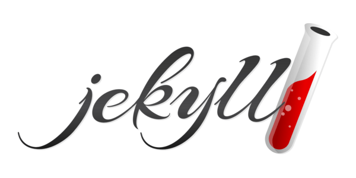
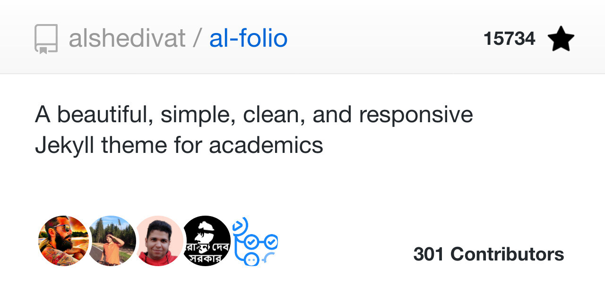

# 📁 Portfolio Hub [ [noviirna.github.io](https://noviirna.github.io) ]

[![Button CTA GH Page]](https://noviirna.github.io/)
[![Button CTA GH Acc Experimental]](https://github.com/orgs/noviirna-labs/repositories)

Welcome to my personal portfolio hub! This repository contains the source code for my website, showcasing my projects,
skills, and experience.

This portfolio website is powered by:

<table style="width:100%; border:0px; table-layout:fixed; text-align:center;">
  <tr>
    <td>

    
<a href="https://jekyllrb.com/docs/" target="_blank">Jekyll</a> static website generator

    </td>
    <td>
        
    
<a href="https://github.com/alshedivat/al-folio" target="_blank">Al Folio</a> Jekyll Theme

    </td>
    <td>

        
Hosted on <a href="https://docs.github.com/en/pages/getting-started-with-github-pages/what-is-github-pages" target="_blank">GitHub Pages</a>

    </td>
  </tr>
</table>

> [!NOTE]
> This portfolio is currently a **Work in Progress (WIP)**. Content, styling, and features are being actively updated.
> Stay tuned for the final version!

---

### 🔎 See it live at [noviirna.github.io](https://noviirna.github.io/)

[![Image Preview Main Page Light]](https://noviirna.github.io/)

### 🛠️ Take a peek at [the stuffs I've built](https://noviirna.github.io/projects)

[![Image Preview Projects Page Light]](https://noviirna.github.io/projects)

### ✍️ This is where I share [what I'm exploring & learning](https://noviirna.github.io/blogs)

[![Image Preview Blogs Page Light]](https://noviirna.github.io/blogs)
 

<!---[ Badges ]--->

[Button CTA GH Page]: https://img.shields.io/badge/Visit_My_Portfolio-noviirna.github.io-brightgreen?style=for-the-badge&logo=jekyll
[Button CTA GH Acc Experimental]: https://img.shields.io/badge/Check_Out_My_Experimental_Repos-noviirna--labs-blue?style=for-the-badge&logo=github

<!---[ Images ]--->

[Image Preview Main Page Light]: readme_preview/personal/preview_mainpage_light.png
[Image Preview Projects Page Light]: readme_preview/personal/placeholder.png
[Image Preview Blogs Page Light]: readme_preview/personal/placeholder.png
[Image Preview Blogs Detail Page Light]: readme_preview/personal/placeholder.png
